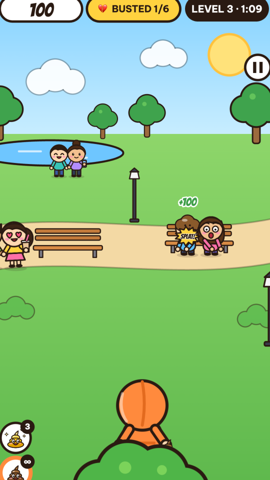
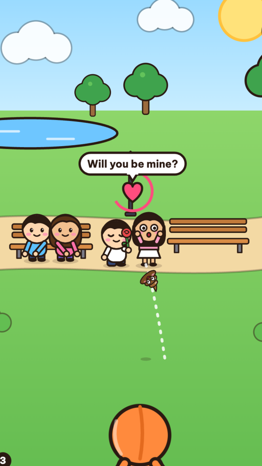
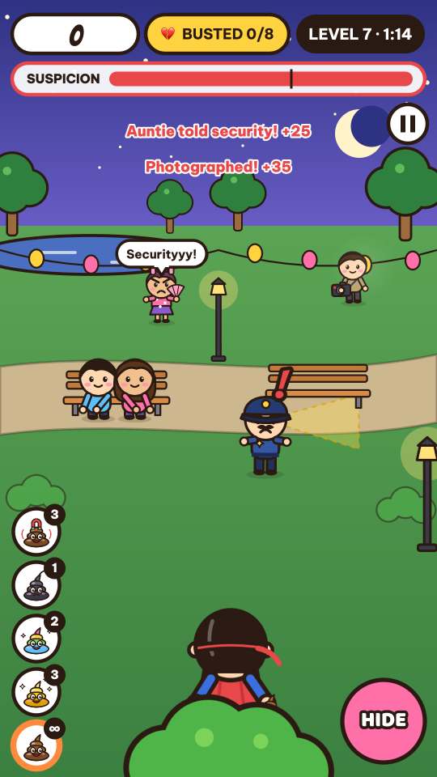
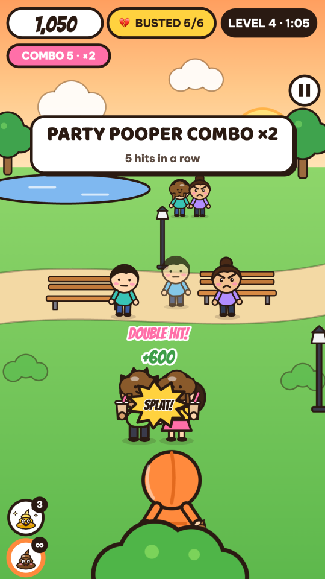
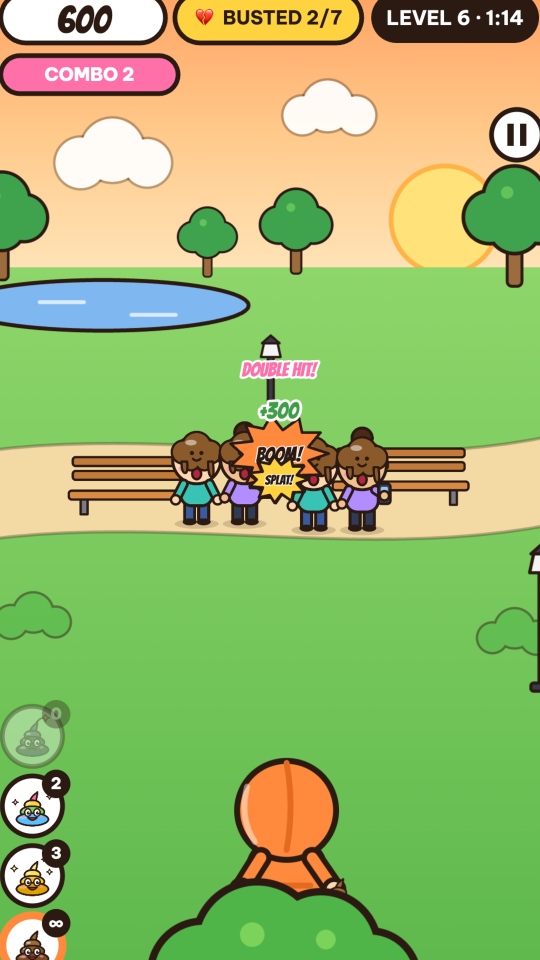
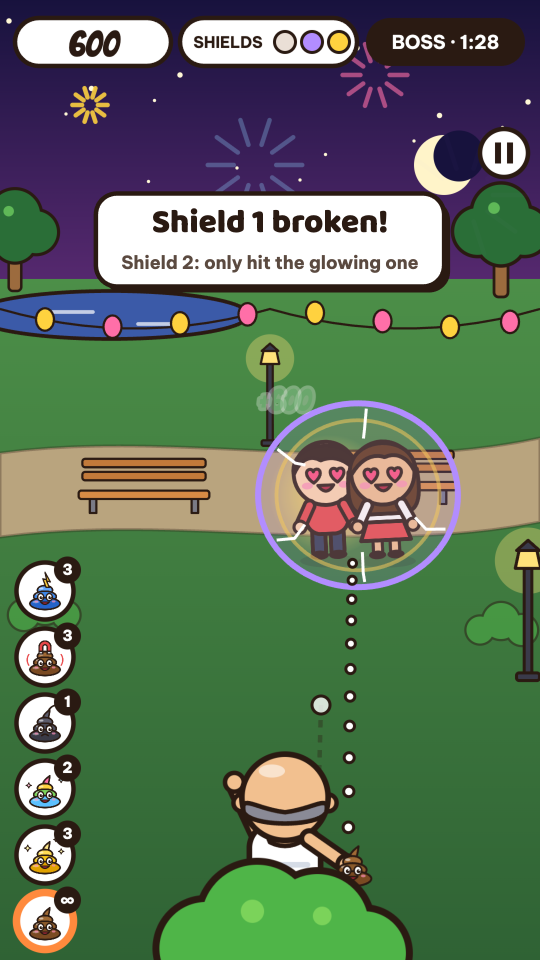
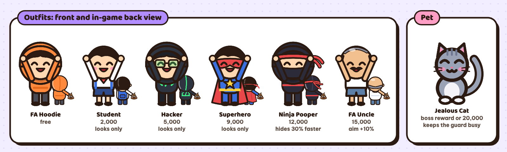
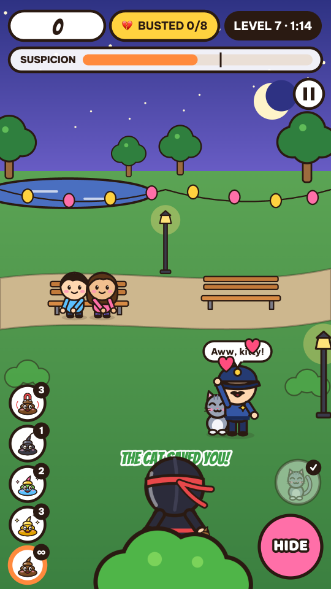
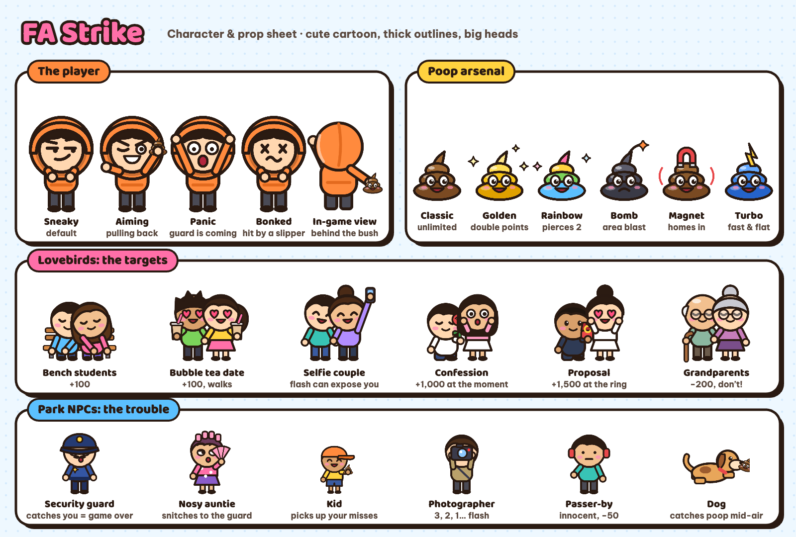

# FA Strike

**Ném Cứt Phá Đám** in Vietnamese. A silly, mobile-first web game: you are the forever-alone party pooper of the park, and your job is to hit the lovebirds with cartoon poop before security catches you.

**[▶ Play in your browser](https://st-quangnguyen2.github.io/fa-strike-game/)** · Vietnamese & English · free, no download

<p align="center">
  
  
  
</p>

## Gameplay

| | | |
| :---: | :---: | :---: |
|  |  |  |
| **Combo ×2** after 5 hits in a row | **Poop Bomb** clears a whole group | **Final boss** with 3 love shields |

You hide behind a bush at the bottom of the screen. Couples sit, walk, take selfies and confess their love on three depth lanes; the farther the lane, the smaller the target and the bigger the bonus. Hit couples, never the innocent, and keep an eye on the **Suspicion** bar: when it fills up, the guard comes to search your bush.

### Controls

| Action | Mobile | Desktop |
| --- | --- | --- |
| Aim and throw | Touch, pull back like a slingshot, release | Drag with the mouse |
| Hide | Hold **HIDE** | Hold **Space** |
| Switch poop | Tap a poop slot on the left | Keys **1–6** |
| Send the Jealous Cat | Tap the 🐱 button | **C** |
| Pause | ⏸ button | **Esc** / **P** |

Only the first 40% of the throw arc is previewed, so landing far shots takes skill.

### Rules

- **Goal**: bust a set number of couples before the timer runs out. Leftover seconds pay 20 points each.
- **Points per throw** = (base + 50 on the far lane) × combo multiplier × 2 for Golden Poop.
- **Base points**: 100 per person · 300 for a Double Hit (both partners) · 1,000 for hitting a confession at the exact moment · 1,500 for a proposal when the ring box opens.
- **Combo**: 5 hits in a row doubles points, 10 triples them. Missing, hitting an innocent or getting bonked by a slipper resets it.
- **Innocents**: grandparents cost 200 points, everyone else 50, and every hit raises suspicion. Let the grandparents walk by safely for a 200 bonus.
- **Suspicion**: the nosy auntie (watch for 👀), the photographer's 3-2-1 flash, selfie flashes and kids who pick up your missed poop all add to it. Hiding drains it.
- **Getting caught**: at 100% the guard searches your bush for 3 seconds. Standing means game over; hiding means you escape.
- **Counterattack**: couples may dodge and throw a slipper back. Hide when you see the **!** or you are stunned for 1.5 seconds.
- **Dog**: it leaps and catches poop mid-air. You lose the throw but keep your combo.
- **Wallet**: every finished level adds points to your wallet (the full total on a win, your throw points on a loss) to spend in the shop.

### Levels

| Level | Time of day | New |
| --- | --- | --- |
| 1 | Morning | Bench students |
| 2 | Morning | Bubble tea couple, passer-by |
| 3 | Morning | Security guard, HIDE button, slipper counterattack, Golden Poop |
| 4 | Sunset | Confession couple, nosy auntie |
| 5 | Sunset | Dog, selfie couple, Rainbow Poop |
| 6 | Sunset | Kid, grandparents, Poop Bomb |
| 7 | Night | Photographer, Magnet Poop |
| 8 | Night | Proposal couple, Turbo Poop |
| 9 | Night | Everyone at once |
| Boss | Fireworks | The Happiest Couple in the Park: shield 1 breaks on any hit, shield 2 only when you hit the glowing partner, shield 3 only with a Double Hit while they hug |

## Shop

Outfits are mostly cosmetic and unlocked with points you earn by playing, so nothing is pay-to-win. Open the shop from the title screen or level select.

<p align="center">
  
</p>

| Outfit | Price | Effect |
| --- | --- | --- |
| FA Hoodie | free | the classic |
| Student | 2,000 | red scarf and backpack, looks only |
| Hacker | 5,000 | black hoodie and green glasses, looks only |
| Superhero | 9,000 | red cape and mask, looks only |
| Ninja Pooper | 12,000 | hides and stands up 30% faster |
| FA Uncle | 15,000 | tank top and paper fan, aim preview 10% longer |

### Jealous Cat



Free for beating the boss, or 20,000 in the shop. Bring it along (toggle in the shop) and, once per level, tap the 🐱 button or press **C**:

- the cat dashes out of your bush and intercepts the guard,
- the guard stops to pet it for 3 seconds ("Aww, kitty!"),
- if the guard was already chasing or searching your bush, the hunt is called off and suspicion drops to 50%.

It only appears in levels with a guard, so save it for the moment the suspicion bar turns red.

<br clear="right">

## Concept art

<p align="center">
  
</p>

The art direction is **cute cartoon + meme + comic + arcade**: big heads on small bodies, 3px ink outlines, a bright park palette (sky blue, grass green, sunny yellow, orange for the player, pink for the couples) and comic sound words like SPLAT!, BONK! and POONG! instead of anything realistic. The couples are deliberately adorable, so the joke is "I'm ruining their moment", not something gross.

The original design review, with every character, rule and the nine design decisions, is in [docs/concept-review.html](docs/concept-review.html) (Vietnamese).

## Features

- **Zero image or audio files.** Every character is drawn from SVG at runtime and rasterized to sprites; every sound effect is synthesized with WebAudio.
- **Original chiptune soundtrack**: four procedurally sequenced tracks (menu, day, night, boss). The music picks up when the suspicion bar turns red.
- **Vietnamese and English**: auto-detected from the browser, switchable from the title and pause screens, and saved with your progress.
- **Portrait 9:16, mobile first**: multi-touch for aiming and hiding at the same time, letterboxed on desktop.
- Progress, best scores, wallet, outfits and settings are stored locally in the browser.

## Run locally

Requires Node.js 22 or newer.

```bash
npm install
npm run dev        # http://localhost:5173
npm run build      # type check + production build into dist/
```

`dist/` is a static site and can be hosted anywhere.

## Deploy

Every push to `main` builds the game and publishes it to GitHub Pages through [.github/workflows/deploy.yml](.github/workflows/deploy.yml).
One-time setup: repository **Settings → Pages → Source: GitHub Actions**.

## Project structure

```
src/
  art/kit.ts        SVG drawing kit: people, poop, dog, scenery
  art/sprites.ts    Character definitions and states, SVG → sprite rasterizer, park backgrounds
  config.ts         360×640 world, lanes, scoring, suspicion, the 10 level definitions
  game/play.ts      Game loop: input, spawning, collisions, scoring, level end
  game/couple.ts    Couples, including the elderly couple and the confession moment
  game/npc.ts       Guard, auntie, kid, photographer, passer-by, dog
  game/boss.ts      Boss with three love shields
  game/render.ts    Depth-sorted scene rendering and HUD
  game/pet.ts       Jealous Cat companion
  skins.ts          Outfits: looks from the front and back, prices, perks
  ui/screens.ts     Menus, level select, shop, intro, pause and result screens (DOM)
  core/             WebAudio sound effects and music sequencer, local save, utilities
  i18n.ts           Vietnamese and English strings
```

To add or change text, edit [src/i18n.ts](src/i18n.ts). The English dictionary must define every key the Vietnamese one has; TypeScript fails the build otherwise.

When running `npm run dev`, the browser console exposes `window.__ncpd` for testing: `__ncpd.startLevel(5)`, `__ncpd.play.update(1/60)`, `__ncpd.music.play('boss')`, `__ncpd.autoPause = false`.

## Roadmap

- Share score cards and clips, leaderboards
